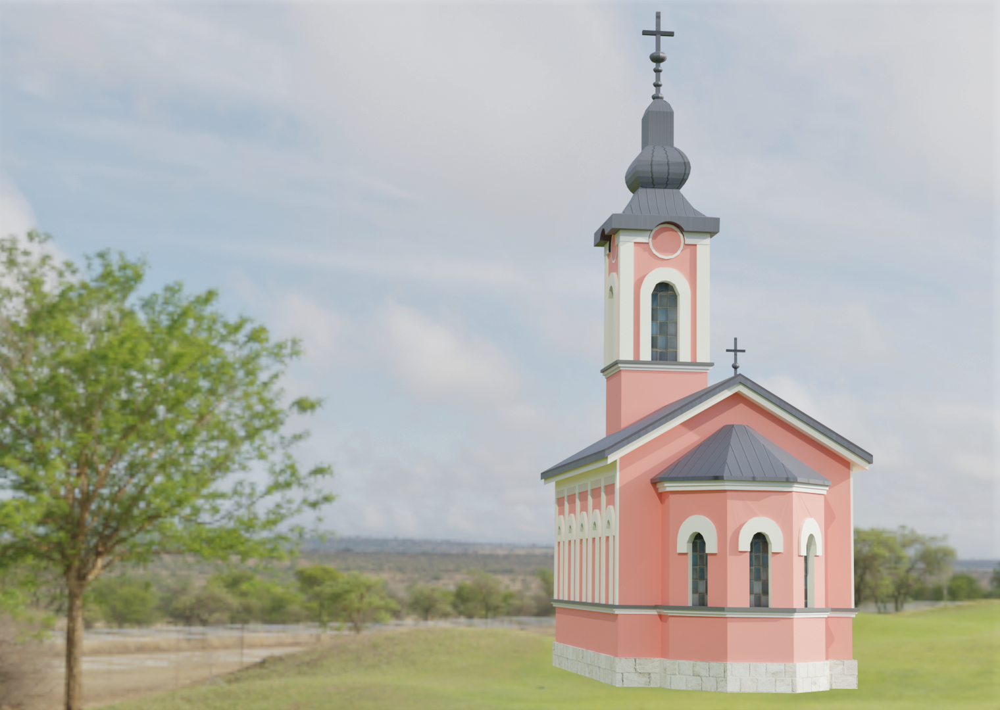

# church-of-the-holy-trinity-AR

Augmented Reality application built as a project for Computer Graphics course at Faculty of Electrical Engineering, University of Sarajevo.

# About

The app was built in Unity and the church model was made in Blender. The model appears on image recognition of a rendered postcard. There are 3 points of interest surrounding the object. A click on each one of them triggers an action. The bell plays authentic sounds of the church's bells. The book shows a brief text about the church and it's history and the tree displays a scrollable photo gallery. 

# Demo 

https://github.com/nkokor/church-of-the-holy-trinity-AR/assets/126979152/794432fa-cf7c-4909-91b5-1eafb955cd0e

# Model

